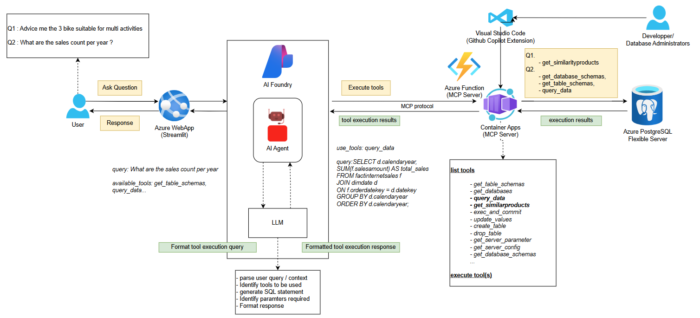

# PostgreSQLChatSemanticSearchNL2SQL

## Project Purpose

This project demonstrates a semantic search and natural language to SQL (NL2SQL) solution using PostgreSQL as the data source, enhanced with AI Foundry models. It enables users to query product data using natural language, leveraging OpenAI embeddings and GPT models for semantic understanding. The architecture includes a backend MCP server for query processing and a Flask front-end for user interaction.

## Global Architecture

- **PostgreSQL Flexible Server**: Stores product data and embeddings, supports vector search via extensions (`vector`, `pg_diskann`, `azure_ai`).
- **AI Foundry**: Provides access to OpenAI models (`text-embedding-ada-002` for embeddings, `gpt4o` as LLM).
- **MCP Server**: Handles semantic search and NL2SQL queries, can run as a local server, Azure Function, or container.
- **Flask FrontApp**: User interface for querying and visualizing results.
- **VSCode**: Development and testing environment.



# Application Demo

<video src="src/images/Front_demo.mp4" width="640" height="480" controls></video>

## Requirements

- PostgreSQL Flexible Server accessible (with required extensions enabled).
- AI Foundry with access to:
  - `text-embedding-ada-002` model (for embeddings)
  - `gpt4o` model (for NL2SQL)
- Visual Studio Code (VSCode)
- Python 3.12+ (recommended for MCP and Flask apps)
- Azure CLI (for deployment steps)
- Azure Function or Container Apps to deploy the MCP Server

## Setup Steps

### Step 1: Setup the virtual environment
 Install dependencies:
   ```pwsh
   cd src
   python -m venv .venv
   .venv\Scripts\Activate.ps1
   pip install -r requirements.txt
  ```
### Step 2: Database Setup
   Follow the [README.md](src/SetupDatabase/README.md), main steps:
   1. **Provision PostgreSQL Flexible Server**
   2. **Run the setup script**
        
### Step 3: MCP Server Setup

You have two options for running the MCP server:
- Local Server for testing with VScode
- Remote Server Azure Function or Container Registry for use with the Flask  application and Azure AI Agent

   **Container Registry**:
      - Deployment details in [README.md](src/MCP_PostgreSQL/README.md)
   
### Step 4: Test MCP Server via VSCode

- Use VSCode to send test requests to the MCP server endpoint.
- Validate semantic search and NL2SQL functionality using sample queries.


### Step 5: Deploy Flask FrontApp
- Requirement: a remote MCP Server has to be deployed firstly (Azure Function or Azure Container App)
- Follow the [README.md](src/FrontApp/README.md)

## References

- [`src/SetupDatabase/setup_semantic_search.sql`](src/SetupDatabase/database.sql): Database setup and embedding generation.
- [`src/MCP_PostgreSQL/azure_postgresql_mccp_sse.py`](src/MCP_PostgreSQL): MCP server code.


For more details, see the individual README files in each subfolder.